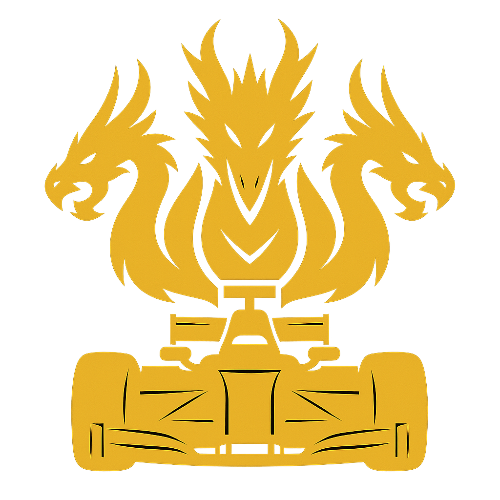
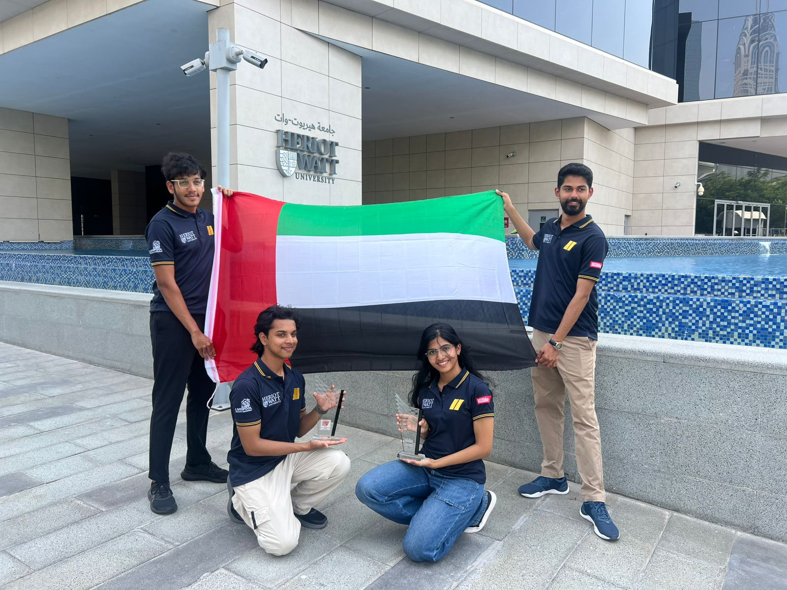
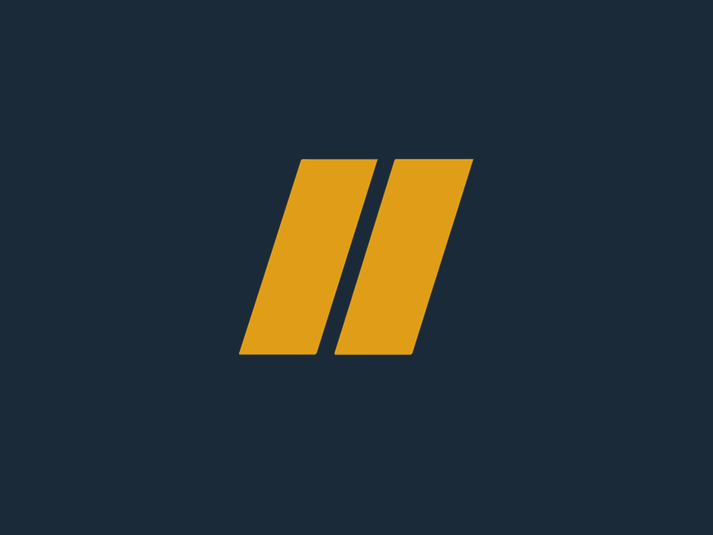
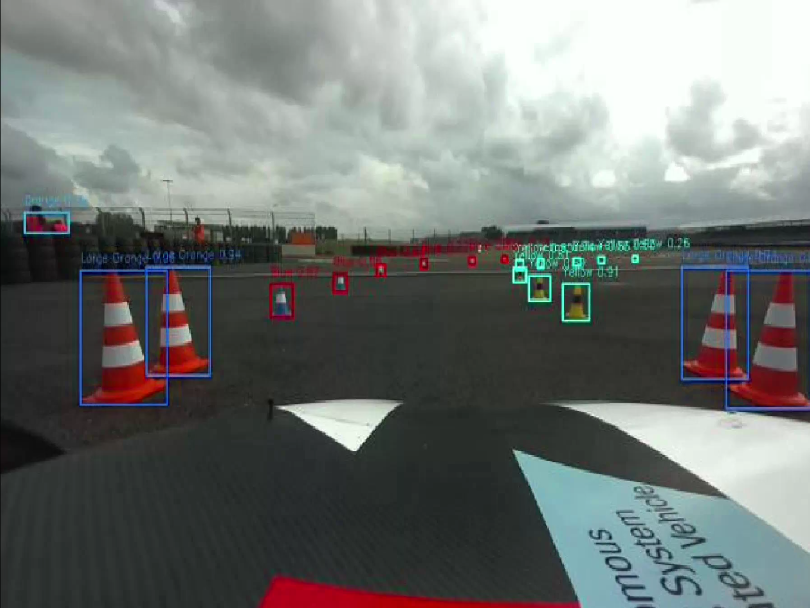

  

 

  <table width="100%">
    <tr>
      <td width="33.3%">
        
      </td>
      <td width="33.3%">
        
      </td>
      <td width="33.3%">
        
      </td>
    </tr>
    <tr>
      <td align="center"><strong>FS-AI 2025</strong></td>
      <td align="center"><strong>Atlas Racing</strong></td>
      <td align="center"><strong>ADS-DV Feed</strong></td>
    </tr>
  </table>

 

# Hydrakon: Autonomous Racing by Atlas Racing FS

**Hydrakon** is the full stack autonomous system developed by **Atlas Racing**, The Formula Student team from Heriot Watt University Dubai

